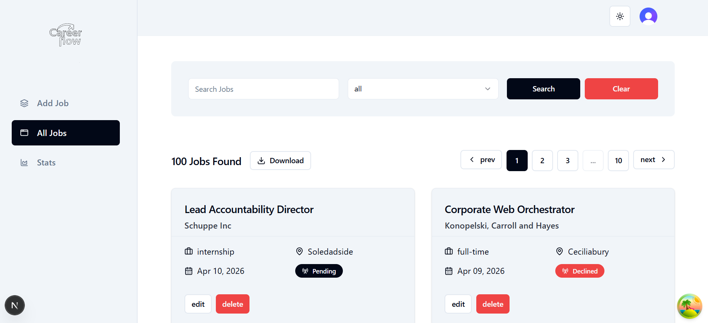
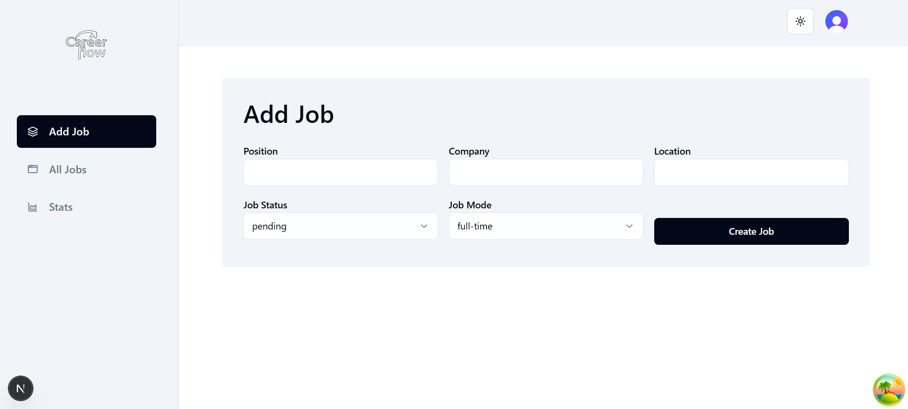
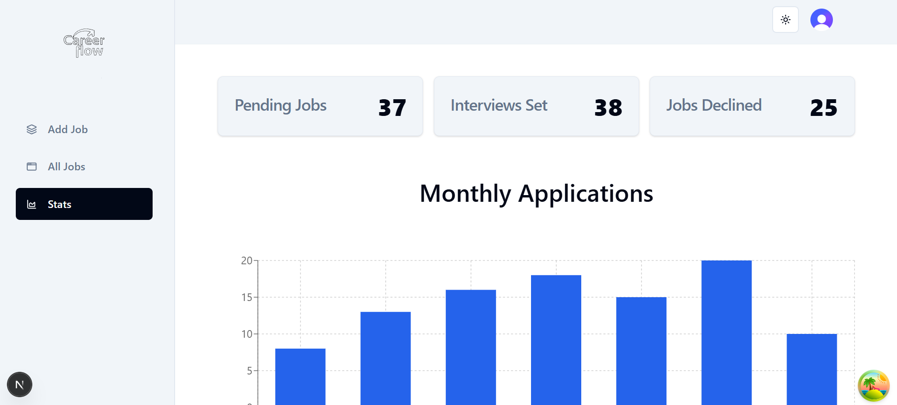

# Career Flow

Career Flow is a full-stack web application for tracking and managing job applications in one place. It gives you a clean dashboard to create, edit, search, filter, and visualize your entire job search process — from pending applications to interviews and declined offers.







---

## Features

### Job Management
- **Create** new job applications with position, company, location, status, and mode fields.
- **Edit** existing entries — form auto-populates with current data.
- **Delete** jobs with user-ownership verification.
- **View** jobs in a responsive card grid showing status badges, mode, location, and date.

### Search & Filtering
- Full-text search across position and company name.
- Filter by job status (`pending`, `interview`, `declined`, or `all`).
- Clear button to reset search and filters instantly.
- URL-based state — all filters are bookmarkable and shareable.

### Pagination
- Server-side pagination (10 jobs per page).
- Sliding window with max 3 visible page buttons.
- Responsive controls: icon-only prev/next on mobile, labeled on desktop.

### Analytics Dashboard
- **Stats cards** showing counts for Pending Jobs, Interviews Set, and Jobs Declined.
- **Bar chart** (Recharts) displaying monthly application volume over the last 6 months.

### Export & Download
- Export all jobs as **CSV** or **Excel (.xlsx)**.
- Includes summary statistics, monthly grouping, and a generation timestamp.
- Client-side file generation — no server round-trip.

### Authentication
- **Email/password** sign up with email verification.
- **OAuth** sign in via Google and GitHub (powered by Clerk).
- **Guest mode** — try the full app with a pre-configured test account.
- First and Last name fields are optional during registration.

### Theme
- Light and dark mode toggle, persisted across sessions.

---

## Tech Stack

| Layer | Technology |
|---|---|
| Framework | [Next.js 16](https://nextjs.org/) (App Router) |
| Language | [TypeScript](https://www.typescriptlang.org/) |
| UI | [React 19](https://react.dev/), [Tailwind CSS 4](https://tailwindcss.com/), [shadcn/ui](https://ui.shadcn.com/), [Radix UI](https://www.radix-ui.com/) |
| State & Fetching | [TanStack Query](https://tanstack.com/query) (React Query) |
| Forms & Validation | [React Hook Form](https://react-hook-form.com/), [Zod](https://zod.dev/) |
| Database | [PostgreSQL](https://www.postgresql.org/) via [Supabase](https://supabase.com/) |
| ORM | [Prisma 7](https://www.prisma.io/) with `@prisma/adapter-pg` |
| Auth | [Clerk](https://clerk.com/) (OAuth + email/password) |
| Charts | [Recharts](https://recharts.org/) |
| Export | [xlsx](https://www.npmjs.com/package/xlsx) (client-side Excel/CSV) |
| Icons | [Lucide React](https://lucide.dev/) |
| Notifications | [Sonner](https://sonner.emilkowal.dev/) |

---

## Project Structure

```
career-flow/
├── app/
│   ├── layout.tsx                  # Root layout (Clerk, providers, fonts)
│   ├── page.tsx                    # Landing page (hero, CTA buttons)
│   ├── providers.tsx               # React Query provider (5-min stale time)
│   ├── globals.css                 # Global styles (Tailwind)
│   ├── (dashboard)/
│   │   ├── layout.tsx              # Dashboard shell (sidebar + navbar)
│   │   ├── add-job/
│   │   │   └── page.tsx            # Create job form page
│   │   ├── jobs/
│   │   │   ├── page.tsx            # Jobs list with search & pagination
│   │   │   ├── loading.tsx         # Skeleton loader for jobs
│   │   │   └── [id]/
│   │   │       └── page.tsx        # Edit job page (dynamic route)
│   │   └── stats/
│   │       ├── page.tsx            # Stats cards + monthly chart
│   │       └── loading.tsx         # Skeleton loader for stats
│   ├── generated/prisma/           # Prisma generated client & types
│   ├── sign-in/                    # Clerk sign-in pages + SSO callback
│   ├── sign-up/                    # Clerk sign-up pages
│   └── user-profile/               # Clerk user profile page
├── components/
│   ├── CreateJobForm.tsx           # Job creation form (Zod + RHF)
│   ├── EditJobForm.tsx             # Job edit form with data pre-fill
│   ├── JobCard.tsx                 # Individual job card display
│   ├── JobInfo.tsx                 # Icon + label info row in cards
│   ├── JobList.tsx                 # Jobs grid with pagination wrapper
│   ├── SearchForm.tsx              # Search input, status filter, clear
│   ├── ButtonContainer.tsx         # Pagination controls (responsive)
│   ├── StatsContainer.tsx          # Stats cards wrapper
│   ├── StatsCard.tsx               # Single stat card component
│   ├── ChartsContainer.tsx         # Monthly bar chart (Recharts)
│   ├── DownloadDropdown.tsx        # CSV/Excel export dropdown
│   ├── DeleteButton.tsx            # Job delete with confirmation
│   ├── Navbar.tsx                  # Top navigation bar
│   ├── Sidebar.tsx                 # Desktop sidebar navigation
│   ├── LinksDropdown.tsx           # Mobile navigation dropdown
│   ├── ThemeToogle.tsx             # Dark/light mode toggle
│   ├── SignInForm.tsx              # Sign-in form (OAuth + email)
│   ├── SignUpForm.tsx              # Sign-up form (OAuth + email)
│   ├── SignUpWrapper.tsx           # Layout wrapper for sign-up
│   ├── GuestUserDropdown.tsx       # Switch to guest account
│   ├── UserProfileDropdown.tsx     # User avatar + profile menu
│   ├── FormComponents.tsx          # Reusable form field components
│   ├── theme-provider.tsx          # next-themes provider
│   └── ui/                         # shadcn/ui primitives
├── utils/
│   ├── actions.ts                  # Server actions (CRUD, stats, charts)
│   ├── db.ts                       # Prisma client singleton
│   ├── types.ts                    # TypeScript types, enums, Zod schemas
│   └── links.tsx                   # Sidebar navigation link config
├── prisma/
│   ├── schema.prisma               # Database schema (Job, Token models)
│   └── seed.ts                     # Seed script (100 jobs via Faker)
├── prisma.config.ts                # Prisma config (datasource, seed)
├── package.json
└── tsconfig.json
```

---

## Getting Started

### Prerequisites

- Node.js 20+
- A PostgreSQL database (e.g. [Supabase](https://supabase.com/))
- A [Clerk](https://clerk.com/) application (for authentication)

### Environment Variables

Create a `.env` file in the root with:

```env
DATABASE_URL=your_supabase_connection_string
DIRECT_URL=your_supabase_direct_connection_string
NEXT_PUBLIC_CLERK_PUBLISHABLE_KEY=your_clerk_publishable_key
CLERK_SECRET_KEY=your_clerk_secret_key
TEST_USER_CLERK_ID=your_clerk_user_id_for_seed
```

### Installation

```bash
# Install dependencies
npm install

# Generate Prisma client
npx prisma generate

# Run database migrations
npx prisma migrate deploy

# (Optional) Seed the database with 100 sample jobs
npx prisma db seed

# Start the development server
npm run dev
```

### Seeding: Development vs Production

The seed script requires `TEST_USER_CLERK_ID` and behaves differently by environment:

- **Development**: clears existing jobs first, then inserts 100 sample jobs.
- **Production**: does **not** clear existing jobs, only inserts new sample jobs.

This behavior is controlled by `NODE_ENV` inside `prisma/seed.ts`.

#### Development seed

```bash
npx prisma db seed
```

#### Production seed (from your local machine)

PowerShell:

```powershell
$env:DATABASE_URL="your_production_database_url"
$env:TEST_USER_CLERK_ID="your_production_clerk_user_id"
$env:NODE_ENV="production"
npx prisma db seed
Remove-Item Env:NODE_ENV
```

Bash:

```bash
DATABASE_URL="your_production_database_url" \
TEST_USER_CLERK_ID="your_production_clerk_user_id" \
NODE_ENV="production" \
npx prisma db seed
```

Important notes:

- Make sure production uses the production Clerk user ID.
- Double-check `DATABASE_URL` before running seed.
- Never commit real credentials to `.env` in version control.

Open [http://localhost:3000](http://localhost:3000) in your browser.

---

## Server Actions

All backend logic runs through Next.js Server Actions with Clerk authentication checks.

| Action | Description |
|---|---|
| `createJobAction` | Creates a new job entry (validated with Zod) |
| `getAllJobsAction` | Fetches paginated jobs with optional search and status filter |
| `getSingleJobAction` | Fetches a single job by ID for the edit page |
| `updateJobAction` | Updates an existing job (validated with Zod) |
| `deleteJobAction` | Deletes a job (verifies ownership via clerkId) |
| `getStatsAction` | Returns aggregated counts grouped by status |
| `getChartsDataAction` | Returns monthly application counts for the last 6 months |
| `getAllJobsForDownloadAction` | Fetches all jobs without pagination for CSV/Excel export |

---

## License

This project is for personal and portfolio use.
